# TalkTo - A Chat API, developed in Udemy REST API classes

<h3>A chat Restfull API serving web and mobile developed on .Net 5 using C#<h3>

<h3>Postman tests 🖥️</h3>
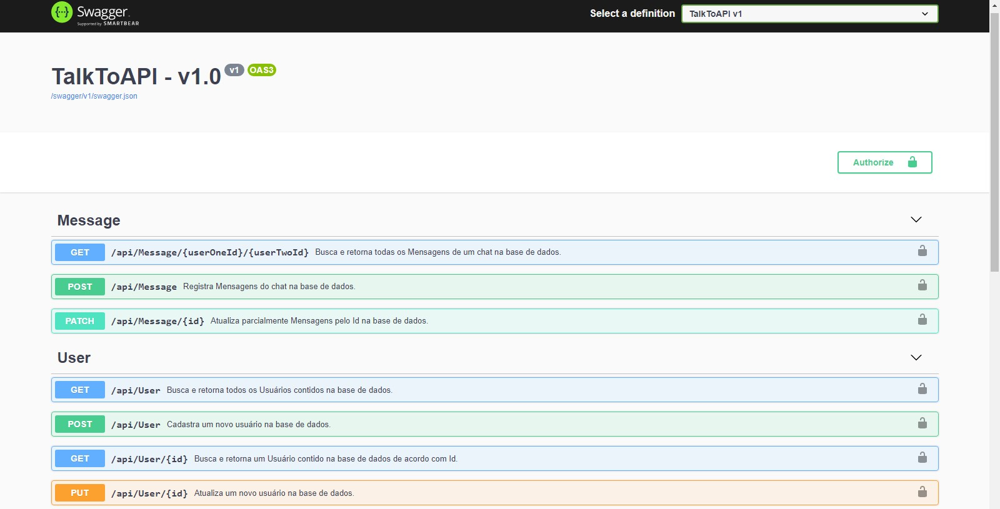</img>
 
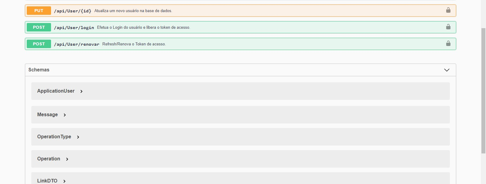</img>
 
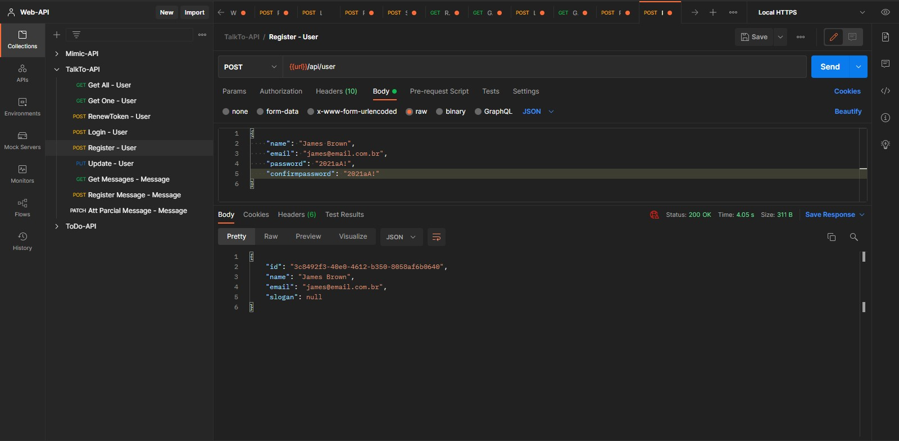</img>
 
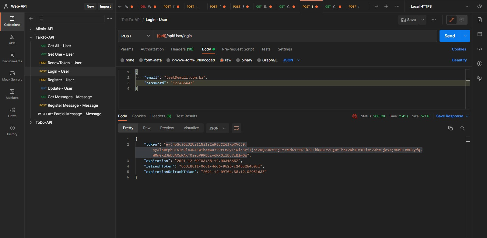</img>
 
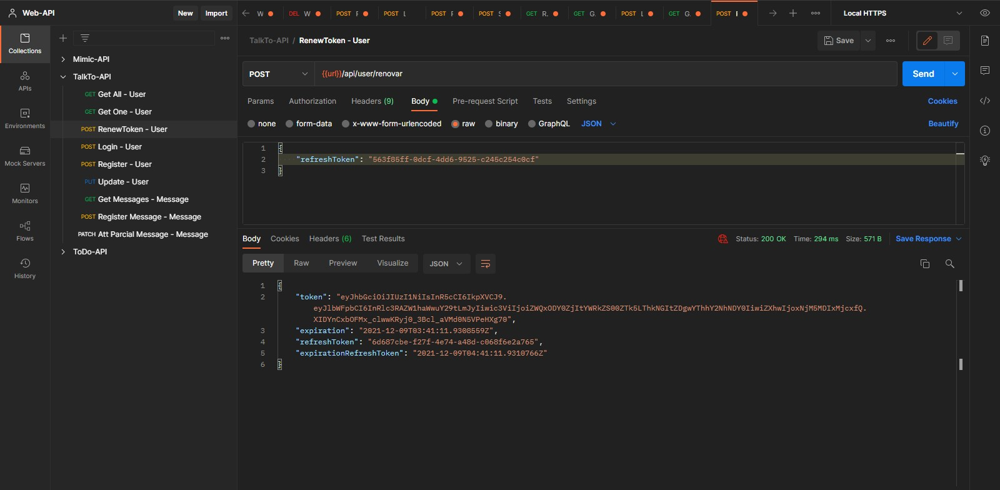</img>
 
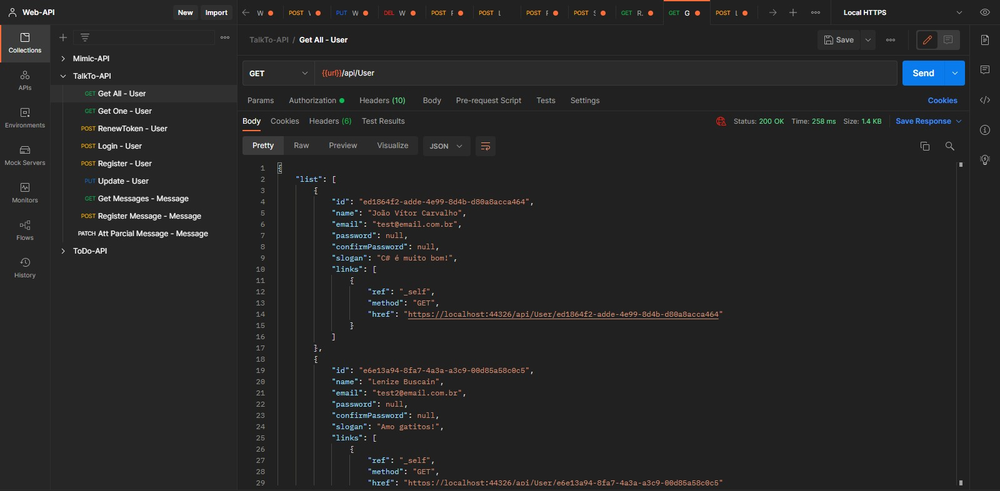</img>
 
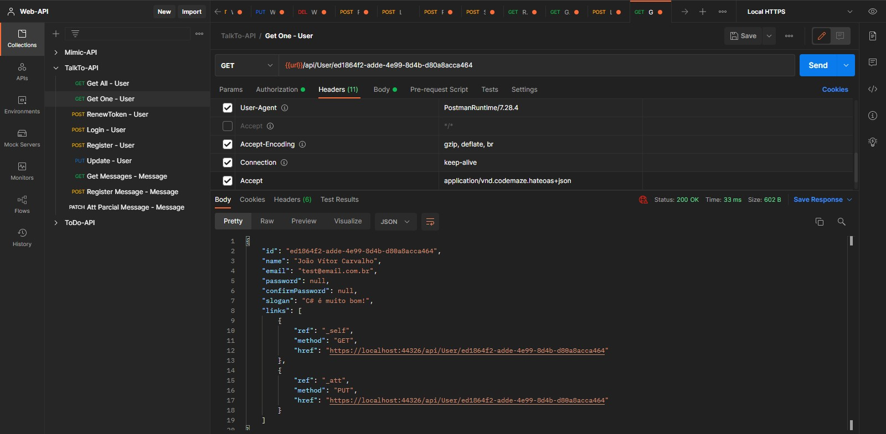</img>
 
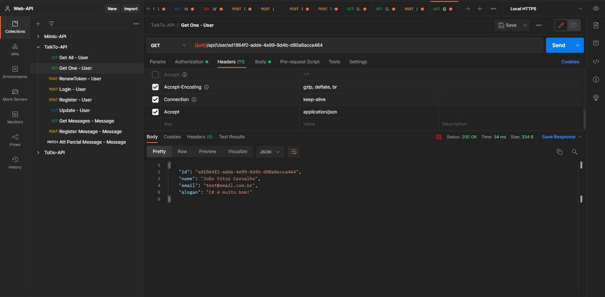</img>
 
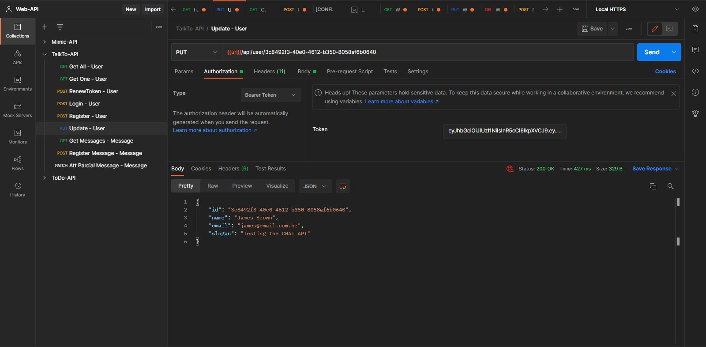</img>
 
</img>
 
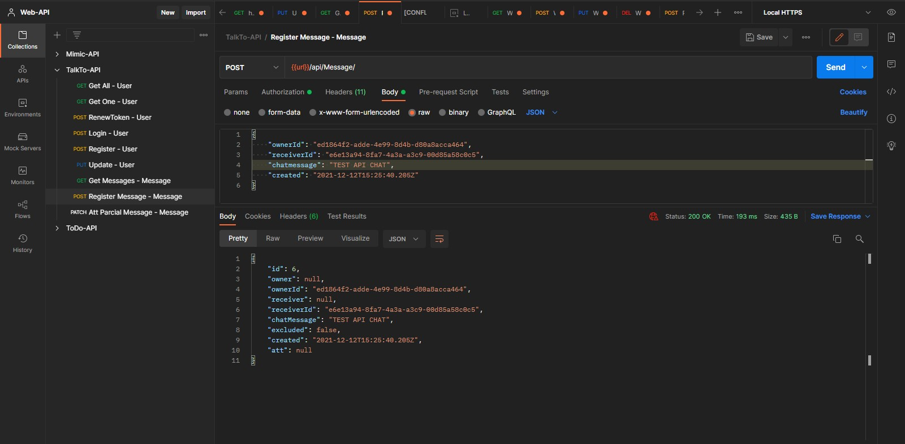</img>
 
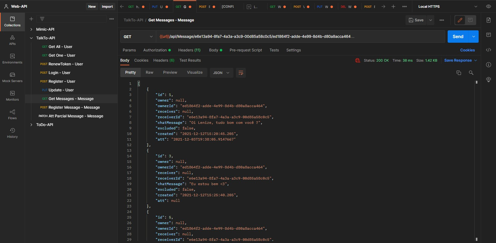</img>
 
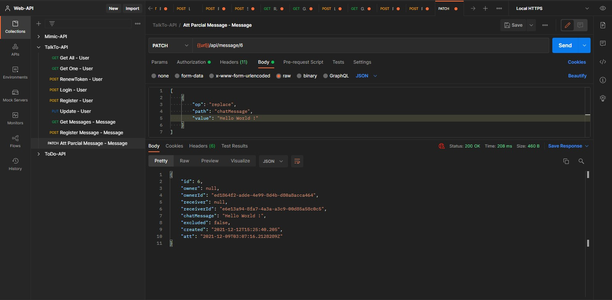</img>
 

<h3>Overview ⮯</h3>

The REST API is based on a Chat App concept, serving web/mobile, this is a chat api with login system, who deliver messages based on a two users conversation, matching the Id related between the user and the messages, you also can patch and delete(disable) the massages, if send wrong, the login system verify the user based on a JWT Token Validation that preserve the user data, having a refresh time, also you can navigate the api with the links provided by the hateoas in the responses, content negociation applyed so you can use it to have, if you want, hyperlinks in the body of the responses to easily navigate between funcionallities.

 
<h3>This project has concepts like :<h3>
<ul>
  <li>Totally RESTFULL API ⬇</li>
  <li>JWT Token Validation on Log-in (with Token refresh) 🔧</li>
  <li>Hyperlinks in the body of any response ⬇</li>
  <li>Content-Negociation for having those hyperlinks if you want [Hateoas] 🔧
   <small>(you need to put in the Accept Header the value "application/vnd.codemaze.hateoas+json")</small></li> 
</ul>
 
<h3>How to run ⮯</h3>

You just need to git clone the project do the migrations for the 
  database update and set the url to your on localhost gate, to set the environment ready to run, and the most important, HAVE FUNN !🧑

ATT: 07/12/2021 - 👨‍💻 João Vítor Carvalho

<em>'This project has no commercial purposes, it was carried out only for the application of my studies'📚</em>

<strong>----João Vítor Carvalho 👨‍💻 ---</strong>
